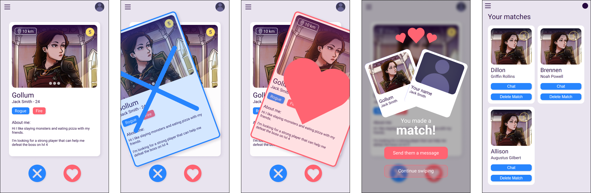

   




Tired of Tinder? Battle Matcher combines the struggle of matching with the fun of gaming! You can match with people based on their character and skills and fight together to gain higher levels and fight greater enemies.

If you've ever had trouble starting conversations, this is the app for you.

The main function of this feature is to see a list of users of which you can decide wether you like or dislike them. If you like them, and they like you back, you get a match and you can view your matches on the matches page.

The goal of Battle Matcher is to connect people with similar interests through gamification. 

## :question: What is this project? What is it for?
In this repository I'll be working on a feature for a matching application. This feature is part of Project Tech which is a project included in the [Communication and Multimedia Design](https://www.hva.nl/opleiding/communication-and-multimedia-design/communication-and-multimedia-design.html) course.

To learn more about tech, checkout the [repository](https://github.com/cmda-bt/pt-course-21-22).


## :green_book: Installing this project

to install this project, clone the repository using [git](https://git-scm.com/)

```
$git clone https://github.com/sasjakoning/blok-tech-2022.git
```

and install it's packages using [npm](https://www.npmjs.com/)

```
$npm install
```

This project uses Atlas [MongoDB](https://www.mongodb.com/) as it's database. To connect your own database make sure to create a .env file and unclude the link to your own database.

```
ATLAS_URI = "YOUR DATABASE LINK HERE"
```

### :books: Packages

Used packages are: 

- [nodemon](https://www.npmjs.com/package/nodemon)
- [body-parser](https://www.npmjs.com/package/body-parser)
- [express](https://www.npmjs.com/package/express)
- [express-handlebars](https://www.npmjs.com/package/express-handlebars)
- [handlebars](https://www.npmjs.com/package/handlebars)
- [mongodb](https://www.npmjs.com/package/mongodb)
- [mongoose](https://www.npmjs.com/package/mongoose)
- [multer](https://www.npmjs.com/package/multer)

## :memo: Usage

### Starting the app
Once you've cloned the repository and installed all packages, you can start running the app.

To run with Node normally:
```
npm run start
```

To run with Nodemon:
```
npm run startdev
```

### Closing the app
To close the app, press `ctrl + C`

## :blue_book: Wiki
If you want to read more about this project and it's process, check out the [wiki](https://github.com/sasjakoning/blok-tech-2022/wiki)

## :heart: Helpful links
Below are some links to resources I found helpful during this project:

- https://waelyasmina.medium.com/a-guide-into-using-handlebars-with-your-express-js-application-22b944443b65
- https://www.youtube.com/watch?v=5QEwqX5U_2M
- https://www.youtube.com/watch?v=cu6VQgT3EEI
- https://www.youtube.com/watch?v=kjKR0q8EBKE
- https://www.youtube.com/watch?v=3p0wmR973Fw
- https://www.youtube.com/watch?v=b59Pdt5LJG8
- https://www.youtube.com/watch?v=DZBGEVgL2eE
- https://www.npmjs.com/
- https://docs.mongodb.com/
- https://mongoosejs.com/docs/api.html
- https://nodejs.org/en/docs/
- https://expressjs.com/
- https://devcenter.heroku.com/
- https://handlebarsjs.com/
- And many, many, many articles from https://stackoverflow.com/

## :lock: License
MIT license